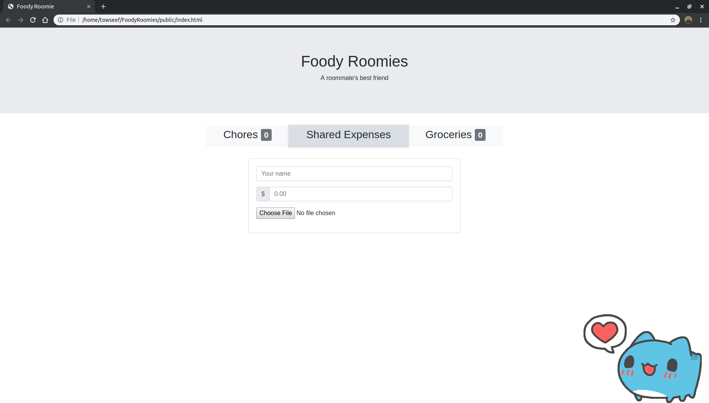
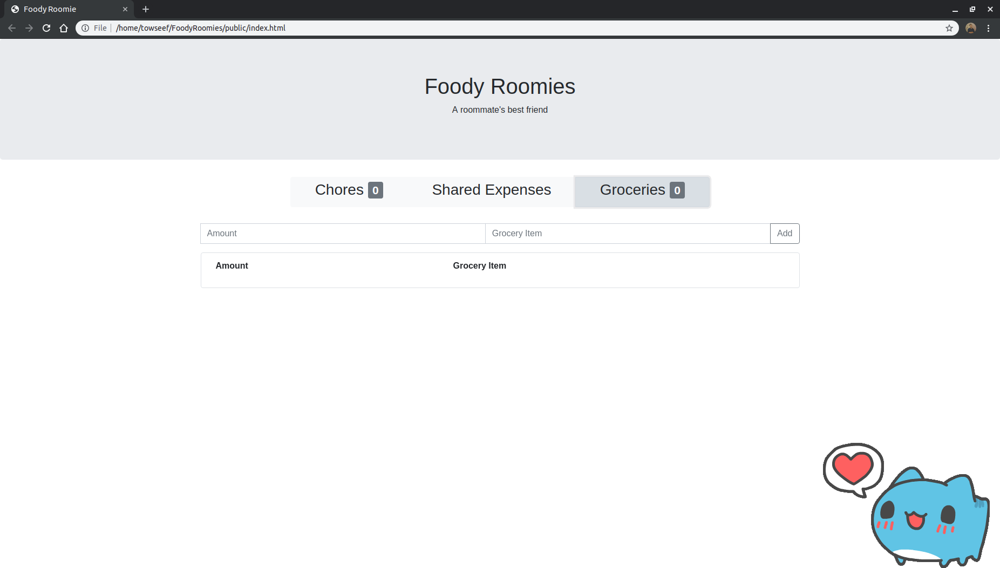

<div style="text-align:center"></div>

# FoodyRoomies
 An app that allows roommates to manage shared groceries and schedules.

## Features
 - slack notification integration
 - receipt and spending documentation
 - global pings and nags for chore deadlines
 - responsive and intuitive
 
## Screenshots
<div style="text-align:center; width:60vw; height:auto"></div>
<div style="text-align:center; width:60vw; height:auto"></div>
<div style="text-align:center; width:60vw; height:auto"></div>


## App Demo (Youtube Video)

[](https://youtu.be/qyGkkDDFgI4)

## Setup & Run
```
mongodb
npm install
npm run create_db
npm start
```
Host however you like and enjoy your time with your roommates!
